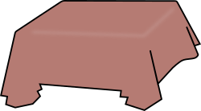

#  Tablecloth

---

Tablecloth is proposing to help with empirical and often interactive work with remote data tables in Python.
This can also be described as a Python package to help data scientists working with data accessible through
some dialect of SQL.
